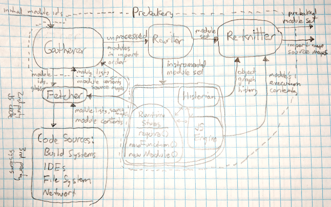

# Modular Decomposition

How the parts of the [prebakery](#prebakery) work together.

## Glossary

*   <a name="prebakery"> *Prebakery </a> : Given [IDs][module id] of JavaScript sources,
    produces equivalent JS that does not use [moot][] declarations and that uses as
    few [eager][] declarations as possible.
    A prebakery takes some [initial module id][]s and does the following:
    1.  Uses a [gatherer][] to collect JS [module source][]s.
    1.  Uses a [rewriter][] to figure out how to run some of that code [early][].
        (This may involve circling back to the [gatherer][] if early code dynamically loads
        ungathered modules.)
    1.  Uses a [reknitter][] to replace the [early][] parts with equivalent code.
    1.  Produces an output [module set][] with [module metadata][] and a [load order][].
*   <a name="gatherer"> *Gatherer* </a> : Part of the [prebakery][] responsible for maintaining a
    [module set][],
    and its [load order][].  The gatherer interacts with the [fetcher][] to get [module source][]s
    for [module id][]s.
*   <a name="fetcher"> *Fetcher* </a> : [second party code][] that abstracts away the file system
    and is the main interoperability point for [third party system][]s like build systems and IDEs.
    A fetcher may be asked to
    *   canonicalize([module id][], [base][]) returns one that can be compared to tell if two
        [module id]s refer to the same module.
    *   list([module glob][], [base][]) returns a list of [module id][]s.
        For example given the glob `foo/*.js`, it may return all JavaScript files
        in `foo` relative to base.
    *   fetch([module id][], [base][]) returns [module source][] and [module metadata][] including
    Any fetcher operation may return the special value DOES_NOT_UNDERSTAND to indicate that the
    fetcher does not understand the [module id][] or [module glob][].  This is meant to allow
    chaining of fetchers.
*   <a name="cassandra"> *Cassandra* </a> : Cassandra is [second party code][] responsible for
    routing error messages to [third party system][]s which may ignore them at their own peril.
*   <a name="rewriter"> *Rewriter* </a> : The rewriter takes the [module source][] of each module
    and instruments it so that it
    *   contains only declarations and code blocks needed to evaluate [early][] code.
    *   proxies operations through the [historian][] so that the needed portions of the object graph
        can be reconstructed.
    *   exports a dump of top level variables so that the [reknitter][] can properly initialize them.
*   <a name="oven"> *Oven* </a> : Loads the [historian][], [runtime stubs][], and [module set][] into
    a [dedicated js realm][] to evaluate [early][] code.
*   <a name="historian"> *Historian* </a> : During evaluation of [early][] code, keeps track of how
    objects came to be so that the [reknitter][] can produce code that recreates the necessary parts
    of the object graph.
*   <a name="runtime-stubs"> *Runtime stubs* </a> : JavaScript code that runs alongside early code.
    This includes implementations of code loading machinery like
    *   implementations of `require` and `import()` that route back through the [fetcher][] so that
        any dynamically required modules end up as part of the [module set][].
    *   an implementation of the proposed `new Module(...)` API that adds dynamically created modules
        to the current [module set][].
    *   library code that makes inputs to [direct eval][] and [indirect eval][] available to the
        [reknitter][] along with the [callsite][] context.
    *   Note: `new Function()` does not require stubbing since the [historian][] should get enough to
        recreate dynamically created functions via other channels.
*   <a name="reknitter"> *Reknitter* </a> : The reknitter is responsible for re-incorporating the
    results of [early] code evaluation back into modules.
    To do this it needs:
    *   [swiss source][]s from the [rewriter][] which show where early code was removed and relate
        holes.  The [rewriter][] can produce these as it instruments and having an AST with holes
        clearly marked avoids overly-tight-coupling between [rewriter][] and [reknitter][].
    *   [object histories][] from the [historian][] that can be turned into generated code that
        rebuilds object values.
    *   a [variable digest][] for each module from the [dedicated js realm][] that relates
        the result of a top-level `const x = foo();` to the AST node for the `const x` declaration
        in the [swiss source][].
    The reknitter emits a [module set][] which the [prebakery][] may repackage based on configuration
    options as either one or multiple JS files.
*   <a name="dedicated-js-realm"> *Dedicated JS Realm* : A [realm][] is a separable JavaScript
    execution environment with its own global object and version of builtins like `Object`.
    Each prebakery run creates a dedicated JS realm to run the rewritten module set.
    There is a 1:1:1 correspondance between module sets, dedicated JS realms, and historians.
*   <a name="early"> *Early* : early code is code that may run during prebaking.
    The [rewriter][] is responsible for separating early code from normal code.
    It decides which code is early based on some rules of thumb including:
    *   Calls to `Function()` and `eval()`, `require()`, `import()` should run early
        so that the module set contains the whole program.
    Declarations may be declared as early via annotations:
    *   `/* @prebake.moot */` indicates a <a name="moot"> *moot* </a> declaration.
        A moot declaration is one that the program should not need to function by the time
        [untrusted input][] could reach it.
    *   `/* @prebake.eager */` indicates an <a name="eager"> *eager* </a> declaration.
        An eagerl declaration is one that should run early where possible, but may not in all cases.
    This annotation suntax may be deprecated in favor of [decorator][]s.
*   <a name="module"> *Module* : A module for the purposes of this design is a source file
    identified by a canonical (see [fetcher][]) [module id][].
*   <a name="module-id"> *Module id* : Identifies a module and provides enough context
    for the [fetcher][] to retrieve [module source][] and [module metadata][].
    It is a goal to support both ES6 `import` and CommonJS `require`, so a module id is
    represented as a URL.  Calls to `require(...)` will produce absolute `file:` URLs
    and uses of ES6 `import` will resolve the string relative to the importing module's
    `import.meta.url`.
*   <a name="module-glob"> *Module glob* : A .[gitignore][] style glob pattern that can be
    used, via [extension APIs][] to scan a local directory for all [module id][]s with
    something in common.  This is meant to enable [code generation][].
*   <a name="module-metadata"> *Module metadata* : Metadata about a [module][] including
    *   any [source map][]
    *   any additional [import map][]s assumed by imports.
    *   any content mime-type possibly including a specification year, e.g. ECMA-262 2019
    *   the [base][] URL
    The [fetcher][] may supply additional metadata fields which will make it through to the output
    unchanged.
*   <a name="module-set"> *Module set* : A set of [module][]s that are [prebaked][prebakery]
    together.
*   <a name="module-source"> *Module source* : The source code of a module whether as a string
    or an AST.
    There are several kinds of source in play:
    *   A fetched source as delivered by a [fetcher][].
    *   A rewritten source as produced by a [rewriter][] from fetched source.
    *   A swiss source as produced by a [rewriter][] for a [reknitter][].
    *   An output source as produced by a [reknitter][] from a [swiss source][].
*   <a name="second-party-code"> *Second party code* </a> : JavaScript or TypeScript code that plugs
    into the prebakery to customize behavior.  This is "second party" because it may be supplied by
    tools developers or users.
*   <a name="third-party-systems"> *Third party systems* </a> : Systems that interoperate with the
    prebakery but which are not necessarily written in JS or which cannot run in the same address
    space.  For example, IDEs, build systems like Bazel and Gulp, Github, etc.
*   <a name="extension-apis"> *Extension APIs* : APIs that are only available to code running
    [early][].  They include
    *    `Prebakery.listModules(glob, base)` : calls out to the [fetcher][] to enumerate module ids
         of modules matching the given [module glob][].
    *    `require.all(glob)` : given a [module glob][], loads each matching [module][] and adds them
         to the [module set][].
    *    `new Module(moduleSource, moduleMetadata)` : creates a [module][] and adds it to the
         [module set][].  The supplied [module metadata][] may include a [source map][].
         Returns a value that may be used with the `import()` operator.
         The return value may be a `string`, but could change to be a [TrustedScriptURL][].
*   <a name="load-order"> *Load order* : The order in which modules were loaded by the [oven][]
    which is the same as the order that modules will be concatenated if a single output is needed.
*   <a name="base"> *Base* : The base URL of the [module][] often used to resolve import specifiers
    to URLs.  This may differ from its canonical (see [fetcher][]) [module id][] if, e.g. resolving
    the canonical [module id][] required following symlinks or HTTP redirects.
*   <a name="direct-eval"> *Direct eval* : A use of JavaScript `eval` that is "direct" (has access
    to the scope in which it lexically appears) per the note after [Ecma262 12.3.4.1][].
*   <a name="indirect-eval"> *Indirect eval* : A use of JavaScript `eval` that is not a
    [direct eval][] so which only has access to the global scope.
*   <a name="callsite"> *Call site* : An AST in a [module source][] that corresponds to a call
    of a statically identifiable operator like `eval` or `import` that the [rewriter][] needs
    to let the [reknitter][] replace with some dynamically computed content.
*   <a name="swiss-source"> *Swiss source* : A [module source][] with holes that the [reknitter][]
    will fill based on dynamic computations performed by [early][] code running in the [oven][].
*   <a name="object-history"> *Object history* : A series of events that describe how a JavaScript
    [`Object`](https://tc39.github.io/ecma262/#sec-object-type) came to have its current state.
    Events are things like
    1.  created via the builtin %Object% constructor
    1.  own property with key `"x"` set to value `123`.
    Events for all objects managed by a [historian][] are totally ordered
    so that the histories of multiple objects may be merged into one replayable script.

[variable digest]: #variable-digest
[initial module id]: #initial-module-id
[untrusted input]: #untrusted-input
[code generation]: #code-generation

[gatherer]: #gatherer
[prebakery]: #prebakery
[fetcher]: #fetcher
[cassandra]: #cassandra
[rewriter]: #rewriter
[oven]: #oven
[historian]: #historian
[dedicated js realm]: #dedicated-js-realm
[runtime stubs]: #runtime-stubs
[reknitter]: #reknitter
[second party code]: #second-party-code
[third party system]: #third-party-system
[module metadata]: #module-metadata
[realm]: https://tc39.github.io/ecma262/#sec-code-realms
[eager]: #eager
[moot]: #moot
[early]: #early
[decorator]: https://github.com/tc39/proposal-decorators
[module]: #module
[module id]: #module-id
[gitignore]: https://git-scm.com/docs/gitignore
[extension APIs]: #extension-apis
[source map]: https://sourcemaps.info/spec.html
[module glob]: #module-glob
[module set]: #module-set
[module source]: #module-source
[import map]: https://github.com/WICG/import-maps
[load order]: #load-order
[base]: #base
[direct eval]: #direct-eval
[indirect eval]: #indirect-eval
[Ecma262 12.3.4.1]: https://tc39.github.io/ecma262/#sec-function-calls-runtime-semantics-evaluation
[callsite]: #callsite
[swiss source]: #swiss-source
[object histories]: #object-history
[object history]: #object-history
[TrustedScriptURL]: https://wicg.github.io/trusted-types/dist/spec/#trused-script-url
